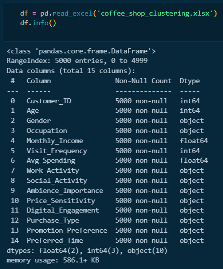
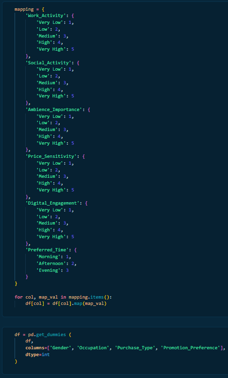
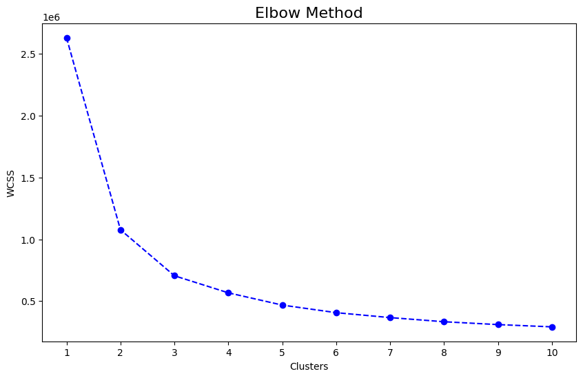
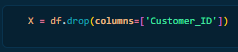
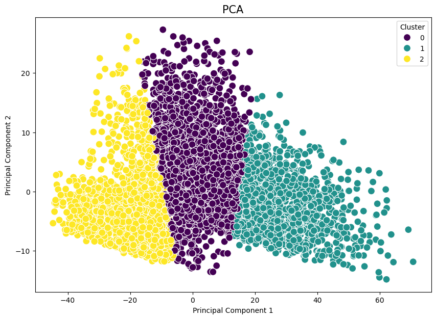
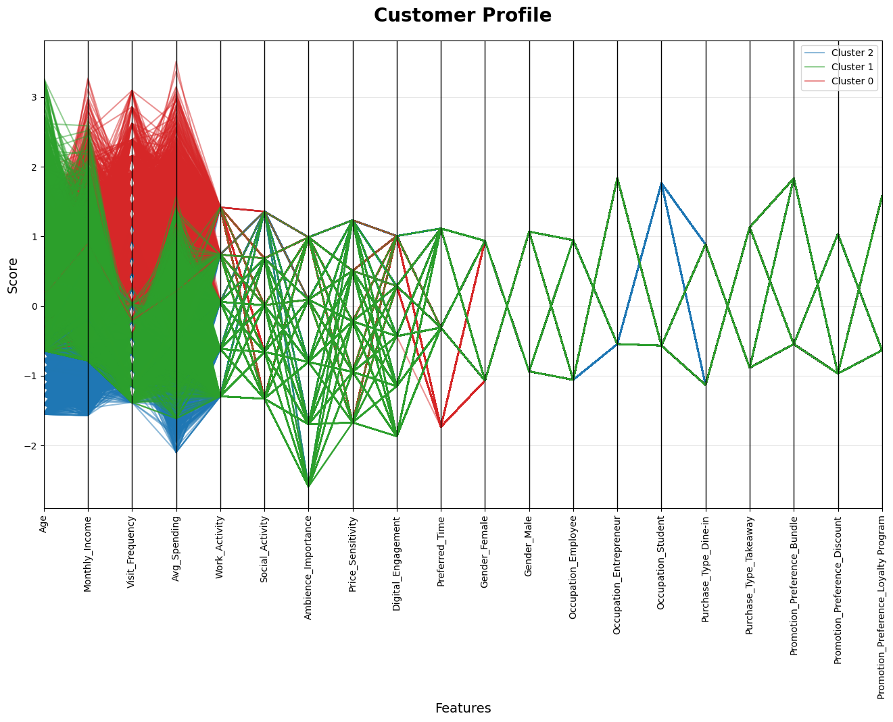
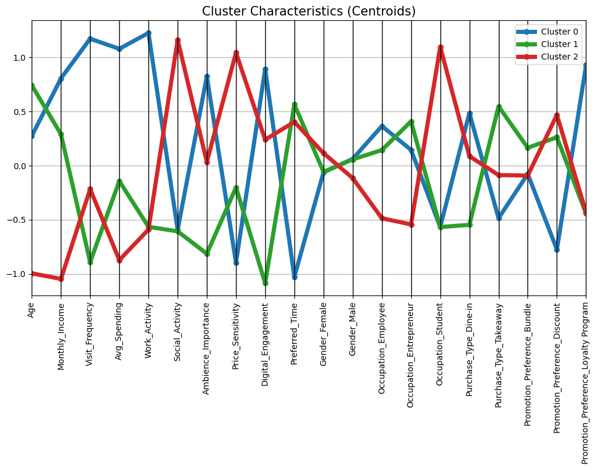
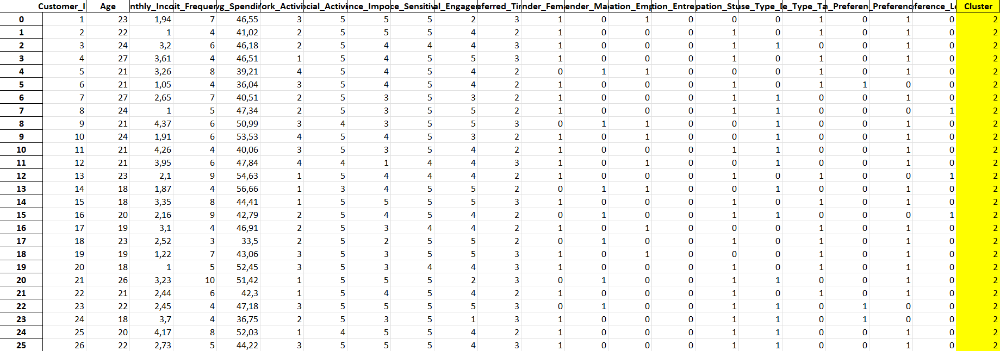
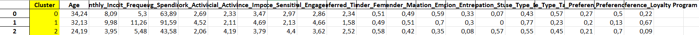

# Coffee Shop Customer Cluster

Saya membangun model KMeans untuk melakukan pengelompokan pelanggan kafe berdasarkan atribut tertentu. Pertama, saya mengimpor dataset terlebih dahulu untuk melihat apakah ada missing values dalam data.

Setelah memastikan data aman, saya melakukan encode pada kolom Work Activity, Social Activity, Ambience Importance, Price Sensitivity, Digial Engagement, dan Preferred Time.

Setelah melakukan encode pada kolom yang diperlukan, saya menggunakan elbow method untuk mencari tahu berapa banyak cluster yang harus diterapkan.

Jika dilihat pada data, perbedaan dari cluster 3 dan cluster 4 sudah mulai pudar atau datar. Artinya, 3 cluster kemungkinan besar merupakan pilihan terbaik. Selanjutnya saya memilih variabel independen, dimana saya memasukkan semua kolom selain Customer ID untuk memaksimalkan pengelompokan.

Setelah memilih variabel independen, saya mulai membangun model. Berikut hasil PCA:

Terlihat bahwa principal component 1 menjadi faktor pembeda yang kuat antar cluster. Perbedaan antara cluster pada pelanggan kafe ini cukup jelas. Saya juga membaut visualisasi untuk menampilkan karakteristik tiap cluster.

Jika grafik ini tidak terlihat begitu jelas, terdapat juga grafik centroids yang sudah saya buat, sebagai berikut:

Berikut karakteristik setiap cluster:

Cluster 1:
Cluster ini diisi oleh pelanggan dengan rata-rata usia cukup tinggi dan pekerjaan seorang pegawai, dimana pendapatan per bulan mereka sangat tinggi dan sangat sering mengunjungi kafe. Mereka banyak menghabiskan uang di kafe dengan tingkat aktivitas bekerja tinggi namun tingkat sosialisasi rendah. Mereka sangat sensitif dengan suasana kafe namun tidak sensitif terhadap harga. Mereka sangat sering menggunakan promo digital dan cenderung datang di malam hari. Mereka lebih suka menikmati pesanannya di lokasi (Dine-in) dan merupakan cluster dengan tingkat loyalty program tertinggi.

Cluster 2:
Cluster ini diisi oleh pelanggan dengan rata-rata usia tinggi dan pekerjaan seorang pegawai atau wirausahawan, dimana pendapatan per bulan cukup besar namun jarang untuk mengunjungi kafe. Mereka cenderung tidak menghabiskan uang di kafe ini. Mereka juga memiliki tingkat aktivitas kerja dan aktivitas sosial yang rendah, serta tidak terlalu peduli mengenai suasana kafe. Mereka relatif tidak sensitif terhadap harga dan sangat jarang menggunakan promo digital. Mereka sering datang ke kafe pada saat pagi hari. Mereka lebih suka untuk membawa pulang pesanan mereka (Takeaway), dan paling sering menggunakan promo berupa diskon daripada bundle dan loyalty program.

Cluster 3:
Cluster ini diisi oleh anak muda (Siswa) dengan pendapatan per bulan yang rendah namun cukup sering berkunjung ke kafe. Mereka cenderung rendah dalam mengeluarkan uang dan melakukan aktivitas kerja di kafe ini, namun memiliki tingkat sosialisasi yang sangat tinggi. Mereka cenderung sensitif terhadap suasana kafe dan juga harga menu. Mereka cenderung sering menggunakan promo digital dan sering datang pada siang hari. Mereka lebih sering menikmati pesanan mereka di tempat (Dine-in) dan merupakan cluster dengan pengguna diskon tertinggi.

Terakhir, saya telah mengekspor dataset lengkap dengan cluster.

Kolom berwarna kuning merupakan cluster yang diberikan oleh model. Berikut distribusi komponen dari setiap cluster:

